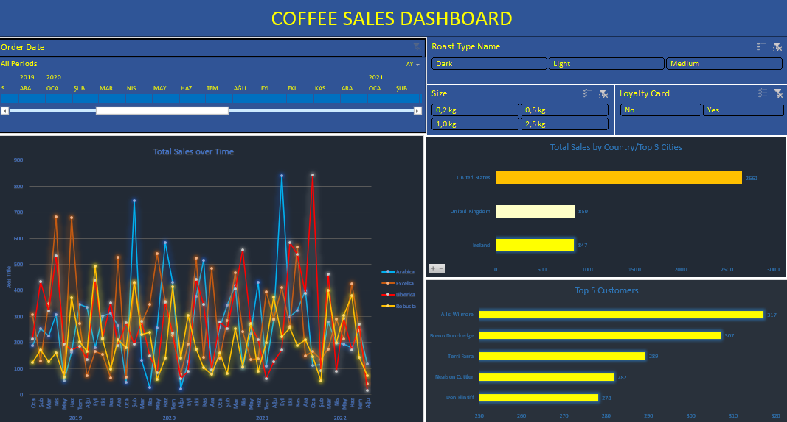

# Data Analyst Portfolio Projects of Eren Kirac
## Coffee Sales Analysis with Excel

---
### Introduction

This is an Excel project on coffee sales analysis of an **_imaginary store_**. The project is to analyze and derive insights to answer crucial questions and help the imaginary store to make data driven decisions.

---
### Problem Statement
1. #### Which coffee type sells the most?
   Understanding the most popular coffee type will allow the store to focus on promoting and stocking the right products
2. #### Which country and its top 3 cities have the highest sales?
   Identifying the geographical locations with the most sales can guide the store's marketing and expansion strategies.
3. #### Who are the top customers of the store, and which customers are most important?
   Analytzing customer data will help the store recognize its most valuable customers and tailor its offerings to retain them.
4. #### During which time period are sales the greatest, and what could be the reason ?
   Exploring the time periods with the highest sales will help the store understand seasonal trends and optimize its inventory and marketing efforts accordingly.
---
### Skills/Concepts Demonstrated
The following Excel features were incorporated:
- Various Excel Formulas,
- XLOOKUP,
- INDEX, MATCH
- IF/IFS
- Pivot Tables/ Pivot Charts, Drill Down in Python Charts
- Timeline, Slicer
---
### Visualization
The report includes four key visualizations:
1. A line chart showing total sales over time by date.
2. A bar chart displaying total sales by country.
3. A breakdown of total sales by the top 3 cities within each country.
4. A chart highlighting the top 5 customers by sales.

[You can download the report here](youtube.com)

  
